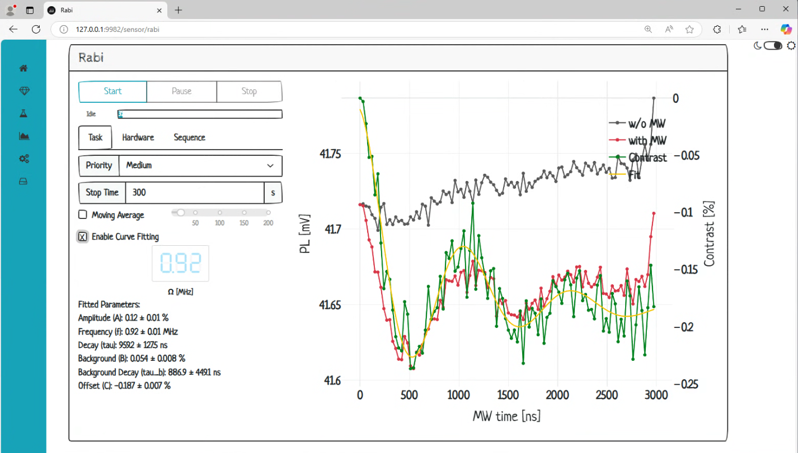

# [Beta] Dashboard for NMR Experiments based on Quantum Sensors

**DiamondGUI** is a high-performance, web-based control system designed for managing diamond quantum sensor experiments. It focuses on speed, modularity, and user accessibility.

## Features
- **Singleton Hardware Management**: Ensures efficient control over hardware instruments, preventing redundant access.
- **Concurrent Measurements**: Run multiple measurement tasks in parallel with multiton task management.
- **In-Memory Data Handling**: Rapid data storage and retrieval directly in RAM.
- **User-Friendly Web Interface**: Built with Plotly Dash, featuring intuitive navigation for experiment control and analysis.

## Architecture Overview

### Hardware Management
- **Singleton Design**: Prevents duplicate hardware instances.
- **Centralized Control**: Instruments managed through individual controller classes.
- **Blocking Communication**: Hardware communication operates on a single-thread main process.

### Measurement Logic
- **Multiton Pattern**: Supports multiple concurrent instances of similar measurements (e.g., ODMR).
- **Task Queue**: Managed by a singleton task manager, enabling task submission, pausing, and stopping.

### Data Management
- **RAM Storage**: Data stored in memory for speed (requires significant RAM for large datasets).
- **Future-Proof**: Flexible architecture for potential database integration.

## WebUI Design
Developed with Dash for cross-platform, multi-user accessibility. Main sections include:

<img src="data:image/png;base64,iVBORw0KGgoAAAANSUhEUgAAAasAAAB2CAMAAABBGEwaAAAApVBMVEX///8/T3UoPWk4SXE9TXQvQm00Rm+Az77u7/KTmq3AxNCFjqQxRG6PlqmjqLgtQGzT1t7c3uRXZIQiOWd/h53Hy9Tu8PP5+fvk5utEVHmaoLE7RnGD1ME9SnO2usaorr1gbIp2gJl9ybtPXX5JY4Bsd5JMaoNytK5RdIlcipV2vLNnnqEdNWVUYYJfa4qwtcNahZJrpqZVfI1GXX1vrqpilZtPcId+QHkpAAAN90lEQVR4nO2deWOjKhfGo4DNQmvMpmZfmnamnSYzd9653/+jvSCLIJiYxNw0HZ5/ZqKowE/wcM7RNhpOTk5OTk5OTk5OTk5OTk5OTk5Of69Gw6dWrRrPm7du09dU3AlQULNwuEpu3a4vqC4IvCsI+Ptbt+zLKerDa6DyPNh3sOpVnF4JFVE/unXrvpae8NVQeWB769Z9KV1zWHme7+yLGpX4V0TlYffEqlFtdE1W4PHW7ftKujKrzq3b95XkWN2PHKv7kWN1P3Ks7keO1WFFYb996zoIOVaH9YSDT7PucKwO6yn4PGvESqwg9GazwyXsBRyrOmVjBSeTidrz0HuB3/+ZqI5DWkL5PXvxvn33TFqOVZ2ysJq9vL69fpsoYN6mRK85HOj9env7k/+efacFHl4MWI5VnTJZwd8P04eH6Z+JsoFq+ktumbzSEm8elL+zEuvUsbqmDFZwsqb9/jZ9F2gmvwgZsnEqUEzep7TEWsCC//IC34sD6xJWcXs/H512yHBvt6/j+cmnEvrUrGY/acdTXmLYTN4eGIp/GAoIp/oGMgUSdOT3/yaFk13AqumFGIXdE46Ilz4ON5b8qQQijPApp8p1fVZJu10xymeyenvggpLVmk1xAs2fKSuQs2K/1681stoCelt4JxzRoRFusDR37LJTbc6qxvVZ9RHyqw16gxUxJBgIZQ7MHke/pr9hPowyNpwm/LbOht7rnxrnwH52glMCy2F2RGgMrBhn1fTPyli0soqlzjllQaSh4ExW8GVKUUzX+ZZnOuE9rMUMB2cEpzIF0rGYFXio07Zg8eqwenZNKZI4gKdiz2Vh1UwBFPLSZWt45qOQ6wJW3uz5lfT823M+Rmbf1gTOL5jb6O+kxPqnLAFTYtWv32q12T8vq6Ga9gBhgEDnkrSSS1gRS9B7/q2tfGfw5fdM2QIns9+/VUcFnDw/zyZmls3XZEW7DDCx+xeE43POzXQRK3qzwOIGz9gCD/4+wioeDvn/ou5waANSzioaWo/grHB7yCSZFVklQ4tJSCpkffiUsIIrpm3q08tCtLQdXEkXsqpNZaz2/TD0SY+1V30fIRT2d/tiT5Wwam/FEfPCEZyVhxHTj5bYobMa9JG/KV6t7ZMK2RZnZazyy84/EDl/sLO39Lg+OavoB70Xg3aKAC8IMV7oZays2ht5BMBAT2gTrKT8Od+hsXqi5mLRsmeZd7ZZ8igrogXtw2BgbepxfXJWj+xlB71z0U570thYrUL9iKXaRoMV6PEdGqsN+6HfA6xCwZNZ1SqsGl3aif55i+3PzmoArIWh2oEmq7hXfJ8FeMpIMFiJ1a/OilsD2iiI/Wxj0GoYqsSq0SaDFS4PdPMBXchqVgxG4TDUewIWSgAUIguAk1iRiVAZWSarnnkUUFppsAr4xXVWmT+EGAPqIN6znP7Q8sCqxio7a1+dQofjwfZjsx0sCvNqNN5uNr3VOB+EnFU8H+w228dho1xWm/3bTy1aBcE+Sdofyl09ef75M1VohZ1us9sJz2KlWJAwzcsYrAbYcgTIPUeClVimBoKjzmrIahmoVjabF9WrS1VkFZFtWE6h0aqPgmzBDIL+Tp0atv1sOwh8OSUwVgtyr9Mdflo+lVpYTV6nZGX7rKx0WaO3socnWbzqu/T+IfYUnxuwjrMC/mbZC8VtgPMeLLJqixVoEGpHyA7irGBvuaNaPoohV7ADUwOMwGd5XFVl1eiRVY14K2bsZw7IbP1FX0Obi0IjMmuT7UFA/gnFVsIKRj1Ey9N7EPqlQ8tkxSIe67X0QiB+cIz47Tz7NysxFe4/OfmvirPUMVYwfKQ92FyIkZKbYkVW4n0W1KJFRk9A/BaTWdW1MJ/wUD7h8WkxtD01qrJ6IjcP4P8nwxRi1Ft1OoPMnpdWB7kQRB+t8XgFcCCuRh2fKYCoNxgsKUQIy7yMNn9g5pd9WIthk8b5pRjNzO++Xk9foAaTrehPYAWBaEXzg23Kk4YKrHg9oQxtJByeNAiqsorZkIQ9sT8JD9S1Kiu6sc8vPe+jjz2/WpdUE/K1V5e0CbPhNGrJWyVzUqNl1tCEdjEqe7nG9LP/EvEr3hl5o3gXz74V4lcyytQtToJHWKF8bo5F3FLcGAVWSzZzKUeM2EmguJUq+5j4ikHW+pGdyLe6s6qyaobKGRfKNBZheWlyYYupSVn5cvolYxKUrdTM+NWah6/ehFvdYPUu4lfP8CJWWsX5QyMUzdRZjdhPzSLgVRdXr8wqYQXBiu9mlQF2x0NVVvTOQdYnzRaKHeQRgU1Tk7AKcj9AG5dH2kxWPJIoJjiTFXwuRLjOZKXbzdwYkzR0Vrya+kKEDXxhElT33fLHKo/wLYznl6qqrOK07BRk2PKJj7JaGPv75FGQNyvx7fYoldW2oJK5MQYrMgk+0BJvwiA4l5X+NvFToG3UWY2znYX3j/lGMT4qs+pqg9S0C/VaVWeF58WtVDmrDjEtPoz91GbP63waK7J4+v7+5yVPYzJYeTPvn/d3GWk8l1Vh7maGiWyMzqoDlN7V6y7qd0JMpMefjfllFdtf10msiuMqjpMkWklW1LsRbIvWpu63OJEVdUooiZoWVplnI18Kn8mqMB9EoXZ/W1npHcrpCldSdVaq2b7k5mRJhL8yK6g/r5J9Z5li3/dDkA84aj8B3NFXu5exKpCzsdJUKyvxYL0mK25OUFs66R+q6Al2IFLN2mGP+Sd4NwhWUZ9eGITgUfE8OVaKLHHhFjPbySK1c8hgb1RnRZsuV3Ar6guGIMAIheq4aiRLnzXEX0k8jpUiC6smH02DBl9il340pSorMq1CxFd6u4Aauengad7udpXnFVV3BUPqcgkK/kAhx6rIipvt0OPrYJuHnakqK3JC0VFPZD9I5RkfgW4gxsMVJlcFwohyrNTOsbDiNYXC91HSO5VZ0aUwL0i/xAN7uU+vyKrBXUnCR3sxK3jEDlQL3J8d2BArb67AXKEKVWQ1xrIbaD6AGnazsMouLxYgF9rsCGyCPFpkYRWEm9SXrT2TVaETzlhfYbV+gpWRNGFlNVfb7Zfnz1ZjRfmIfG66Gyj7rKzIwl+4/S5iBelcG89F0MHCKhyTk0c7+bNGvwWw+y2ebH6Llua3aPBFk+GUs7KKlSS6Q1mMlVjFdJQK9zjZrfV2x8ZqjmW9L2IFWKO6qMTPLiev3oU+JqxNV+khfyD3LgS2I8TEyKpjpp/bczlbeZgbHUgYrcIq2QDlQUt3K6EwepdZx1Udc6BsO196mL5bcS6B5mw/u9oL7Up+dtUtxacxGcnjsY6g6MSxs0pkTtTBpJayvNv852hMzTqIpRvfV+645pYW5qyigawauc3CGmwL2fP8XjZYARndKx5xavwqzOcrEY3yDsav1IhXE+t3joiqGG/1lORIyyB2eCgfpYxVuz0nas/HS5+eHiqvd+3ohNgiM8Co2yFL30Ci2+BwnLWnuwT5OLyElWxTt4SVvGnEdyLPZpVHEZK0GNIqxoX5qbHo2IRbokqKhogUFxa2Jay4t/3Ii1llrDBXdm6IesrJu/QDwkFIc3+BB4K9eDR1+x4MwiBNsRbYvxdWHhpEZCAlLZGDlL89Vcy3EEZ22NGO8HDezgVvC0j36nOt7N2DHYddbrA3ylnlgiBM9aj73Jd2GdpEDbK+yYzbeJlNu9RNSI6Rg9mMiZS9IHhjVh5p6GaDKuQxDUP9CJEaoy65BE+Ig83HQLSjjNWWD8ODiZQWVtEPP1cINgPjrYVoi1EQYBymtHaPfX/Jts83IQ4A9RNu88rQ3Mv8BKMfyK8cF/6PWZVl+5n5gR1rfqAWeRfTWlYkADIZxsoq8g9VUcj2XmOiyh5LaQ7346c5q3w8zK8czcedzuNercpo2FbPkbRL3727PSultHqLm3m3S/OT/xDq7dr3lZ3ibYASVtzM7RtrZ02f+j3827ECqdptlncPlsXPk4O0eFfvlT8MIJ7RgpVeVpiRRz5L7lhx41/1ycFQj26HlsHQ8QtHmL6hIcynSjE/snbomTgi2fGgwd5wrIQ/cLAM5dtUyCus7dkXEAqpJMOPA0cwjR4DbiLKd99WdPIs5JQNeEbnsY8yOFbMz75vdAeQmEEhBluj3+OlH/qp8TAZyiNKQ06jxS5ApIy0KUc7cirtIyXtDX/2Hf2AvGOlxESSKIrsj3eyw7q9/AipOIq6Khv1VIvVDovM/AOBKy7Hyha/+o/UQ0Ca/PD4u4iO1e1Y7dUqVvgLXY7V7Viprx35Jfmbqv56Vix6cZM/DNORrEBJBruuv55V9wfd2S9Jdb2q2KU9GPRXlS7/17NqLOiH2I6sQq+kxQ+EUD8dV/zij2PVaLbbl30d7HyRS3erj+gFwp+YlXTBibiwdH6vSuLCqBBJrsDqbpT0Nmd+Y6R+Hc+38JAYaMUFpBhGcqC1jI+F3D2rzyRbHhObISKxuBeZXvKvcAoDbifWlAGjmRh/ptOxqlO2/ECPPvXbuRcc0yjmqJV/4tB/iml+oBxFEGZHmJ+lc6zqlDXvFoMPoI4RgNMNVuc3HGy0L1+xIwxUjlWtKstnL/42Pu147AjHqna5v9NzP3Ks7keO1f3IsbofOVb3I8fqfuRY3Y+GRdd4rSq8NOp0kZoWb0N9OpYp6XSStvbc8noE6vijQ05C+bsV9QtVSD5xOkEdI5JRl8B5f8rNqVzbK5mCQepmwNrV8gPrX0S6RBD4K4fqCkoeN9ivVSgdfJo0hS+nUbNWjdyYcnJycnJycnJycnJycnJycnJycnI6Tf8HJAokXfy/k6cAAAAASUVORK5CYII=" alt="Dash" style="width:50%;">

- **Home**: View task queue, logs, and navigation.
- **Sensor**: Conduct sensor characterization (e.g., ODMR, Rabi oscillations, T1/T2 measurements).
- **Spectrometry**: Perform NMR spectroscopy and quantitative analysis.
- **Calibration**: Tools for hardware and measurement calibration.
- **Hardware**: Direct control over connected instruments.

## Getting Started
1. Clone this repository:
   ```bash
   git clone https://github.com/cct1123/diamondgui.git
   cd diamondgui
   ```
2. Install dependencies:
   ```bash
   pip install -r requirements_pip.txt
   ```
3. Run the server:
   ```bash
   python main.py
   ```
4. Access the dashboard at `http://localhost:9982`.

## Contributions
Contributions are welcome! Please open an issue to discuss improvements or submit a pull request.

---

For more details on Dash, visit the [Dash Tutorial](https://dash.plotly.com/tutorial).

